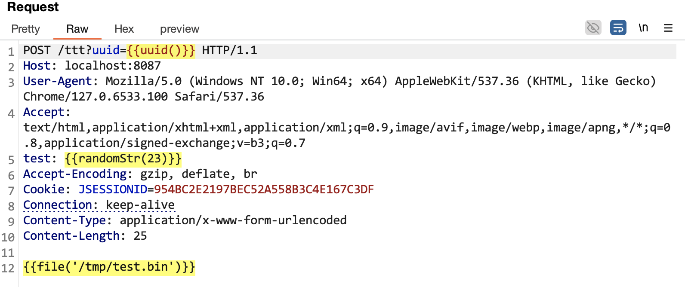
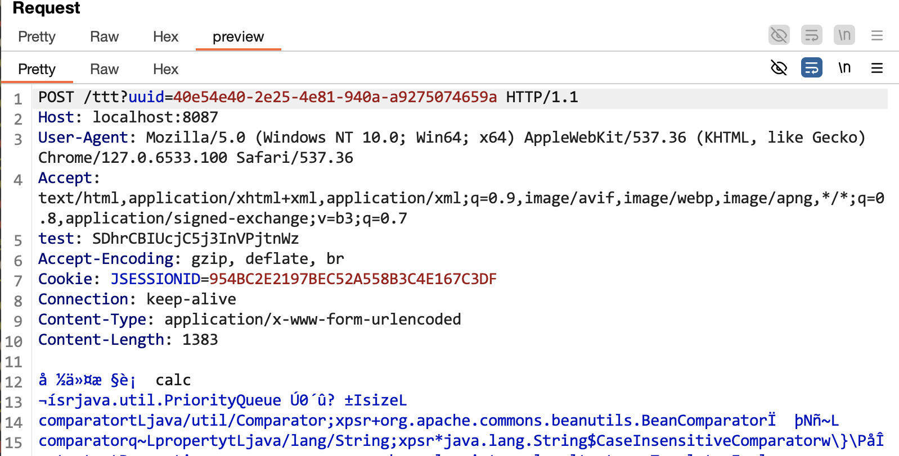

# DataExpr


## 简单介绍

一个简单的表达式运算Burp插件。






## 函数列表

### b64e
- **函数名称**：b64e
- **返回值**：String（Base64编码后的字符串）
- **参数**：
  - content：byte[]或String类型，待编码内容
- **说明**：对输入内容进行Base64编码
- **示例**：
  ```
  b64e("hello")  // 返回："aGVsbG8="
  b64e(file("test.bin"))  // 返回：文件内容的Base64编码
  ```

### b64d
- **函数名称**：b64d
- **返回值**：byte[]（Base64解码后的字节数组）
- **参数**：
  - content：String类型，待解码的Base64字符串
- **说明**：对输入的Base64字符串进行解码，返回原始字节数组
- **示例**：
  ```
  b64d("aGVsbG8=")  // 返回：字节数组 [104, 101, 108, 108, 111]
  hex(b64d("aGVsbG8="))  // 返回："68656c6c6f"
  ```

### file
- **函数名称**：file
- **返回值**：byte[]（文件内容的字节数组）
- **参数**：
  - filePath：String类型，文件路径
- **说明**：读取指定路径的文件内容，返回字节数组
- **示例**：
  ```
  file("/tmp/test.txt")  // 返回：文件内容的字节数组
  b64e(file("/tmp/test.txt"))  // 返回：文件内容的Base64编码
  ```

### md5
- **函数名称**：md5
- **返回值**：String（32位小写十六进制MD5值）
- **参数**：
  - text：String类型，待计算内容
- **说明**：计算输入内容的MD5哈希值
- **示例**：
  ```
  md5("hello")  // 返回："5d41402abc4b2a76b9719d911017c592"
  ```

### urlencode
- **函数名称**：urlencode
- **返回值**：String（URL编码后的字符串）
- **参数**：
  - text：String类型，待编码的字符串
  - encodeAll：Boolean类型，可选，默认false。true表示对所有字符进行百分号编码
- **说明**：URL编码，当encodeAll为true时，会对每个字符都进行百分号编码；为false时保留常用字符（/ : ? = &）
- **示例**：
  ```
  urlencode("hello world")  // 返回："hello%20world"
  urlencode("hello/world", true)  // 返回："%68%65%6c%6c%6f%2f%77%6f%72%6c%64"
  ```

### urldecode
- **函数名称**：urldecode
- **返回值**：String（URL解码后的字符串）
- **参数**：
  - text：String类型，待解码的URL编码字符串
- **说明**：对URL编码的字符串进行解码
- **示例**：
  ```
  urldecode("hello%20world")  // 返回："hello world"
  ```

### uuid
- **函数名称**：uuid
- **返回值**：String（UUID字符串）
- **参数**：无
- **说明**：生成随机的UUID
- **示例**：
  ```
  uuid()  // 返回："550e8400-e29b-41d4-a716-446655440000"
  ```

### randomStr
- **函数名称**：randomStr
- **返回值**：String（随机字符串）
- **参数**：
  - count：Number类型，生成的字符串长度
- **说明**：生成指定长度的随机字符串（包含大小写字母和数字）
- **示例**：
  ```
  randomStr(8)  // 返回："Ax7Kp9Qs"
  ```

### randomInt
- **函数名称**：randomInt
- **返回值**：Number（随机整数）
- **参数**：
  - min：Number类型，最小值（包含）
  - max：Number类型，最大值（包含）
- **说明**：生成指定范围内的随机整数
- **示例**：
  ```
  randomInt(1, 100)  // 返回：42
  ```

### gzip
- **函数名称**：gzip
- **返回值**：byte[]（GZIP压缩后的字节数组）
- **参数**：
  - input：String或byte[]类型，待压缩的数据
- **说明**：对输入数据进行GZIP压缩
- **示例**：
  ```
  gzip("hello")  // 返回：压缩后的字节数组
  b64e(gzip("hello"))  // 返回：压缩数据的Base64编码
  ```

### ungzip
- **函数名称**：ungzip
- **返回值**：byte[]（GZIP解压缩后的字节数组）
- **参数**：
  - input：byte[]类型，GZIP压缩的数据
- **说明**：对GZIP压缩的字节数组进行解压缩
- **示例**：
  ```
  ungzip(gzip("hello"))  // 返回：解压缩后的字节数组
  b64e(ungzip(gzip("hello")))  // 返回："aGVsbG8="
  ```

### hex
- **函数名称**：hex
- **返回值**：String（十六进制编码字符串）
- **参数**：
  - input：String或byte[]类型，待转换的数据
- **说明**：将输入数据转换为十六进制编码
- **示例**：
  ```
  hex("hello")  // 返回："68656c6c6f"
  hex(gzip("hello"))  // 返回：压缩数据的十六进制表示
  ```

### unhex
- **函数名称**：unhex
- **返回值**：byte[]（解码后的字节数组）
- **参数**：
  - hexStr：String类型，十六进制编码的字符串
- **说明**：将十六进制编码的字符串转换为字节数组
- **示例**：
  ```
  unhex("68656c6c6f")  // 返回：字节数组 [104, 101, 108, 108, 111]
  b64e(unhex("68656c6c6f"))  // 返回："aGVsbG8="
  ```
